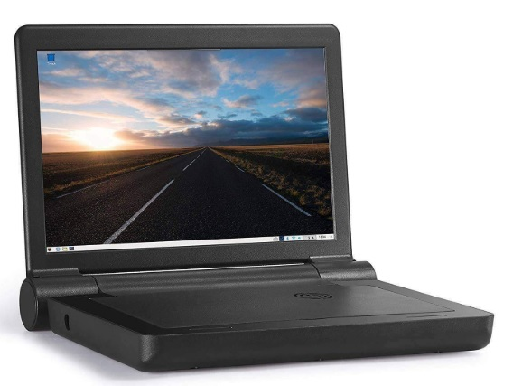

<h1>Raspberry Pi Pairing project</h1>
This project is based on the 10 in Maker Shack laptop:  
But can also be tested on a LAN network with windows pcs.

The idea is to connect 2 (or more) raspberry pi using the pi's wifi chip and then chat or play games.

Code is written in python in a module fashion so that students can add more games. 
Currently the games that are supported are:
<ul>
  <li>Chat (not really a game but the basis of all game communication)</li>
  <li>Tic Tac Toe</li>
  <li>Checkers</li>
  <li>Chess</li>
  <li>Some kind of tank battle(To be implemented)</li>
  <li>Panzer Leader (To be implemented)</li>
</ul>